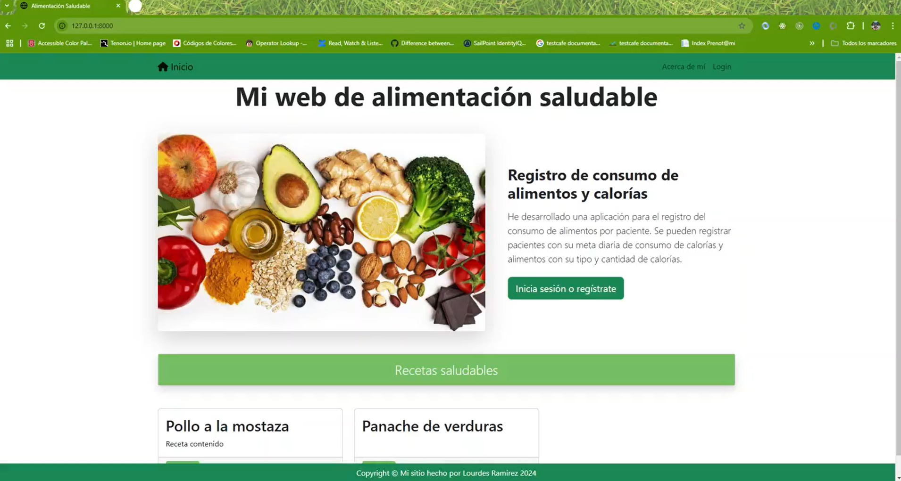

# Entrega Final Curso Pyhton Lourdes Ramirez

## Alumno

Lourdes Ramirez

## Curso

- Curso de Python
- Comisión n° 60095
- Profesor Esteban Acevedo
- Ayudante: Nicolas Dziuma

## Link al video de la app en funcionamiento

https://drive.google.com/file/d/1j_124gSI-GuUwwda0-d5htge4Ejkfc7g/view?usp=sharing

## Objetivos del Proyecto

Este es un proyecto para llevar un registro por paciente de los alimentos y las calorías consumidas.
Se crean Alimentos dentro de una Categoría con su correspondiente valor calórico.
Se crean Pacientes con una meta de consumo de calorías.
Luego se crean Consumos relacionando Usuarios con Alimentos, calculando automáticamente la cantidad de calorías consumidas.

## Aspectos técnicos

He creado esta aplicación web usando Python. He utilizado también Django y Bootstrap. He creado 4 modelos en la aplicación.

## Puntos a mejorar

Considero que todavía se puede hacer bastante para mejorar el estilo de la aplicación.
Me gustaría vincular el proyecto a alguna api que me permita saber el valor calórico de un alimento consumido sin tener que ingresarlo manualmente.
También se podría calcular por paciente las calorías consumidas en una fecha y comparar con su meta diaria. Lo mismo podría hacerse con otro tipo de nutrientes, por ejemplo calcular metas diarias de consumo de proteínas o de fibra.
